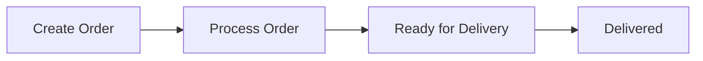

<h1 align="center">🧺 LaundryOS</h1>
<h3 align="center">⚡ Smart Laundry Order Management System</h3>

<p align="center">
  
  
  
  
</p>

<p align="center">
  <b>📦 Manage Orders • 💰 Track Revenue • 🔄 Control Workflow</b>
</p>

---

## 🧠 What is LaundryOS?

> A lightweight **order management system** for laundry & dry-cleaning businesses.

Designed to:
- 📦 Create and manage customer orders  
- 💰 Automatically calculate billing  
- 🔄 Track order lifecycle  
- 📊 Provide real-time dashboard insights  

---

## ⚙️ System Flow  



👉 Enforced as **forward-only transitions** (no invalid status changes)

---

## ✨ Key Features  

### 📦 Order Management
- Create orders with garments & quantities  
- Auto-generate unique order IDs  
- Dynamic delivery date estimation  

---

### 🔄 Workflow Control
- Status pipeline:
  ```
  RECEIVED → PROCESSING → READY → DELIVERED
  ```
- Prevents invalid transitions  

---

### 💰 Billing System
- Auto price calculation  
- Predefined garment catalog  
- Custom price override  

---

### 🔍 Search & Filters
- Filter by:
  - Status  
  - Customer name  
  - Phone  
- Search by garment type  

---

### 📊 Dashboard Analytics
- Total orders & revenue  
- Orders per status  
- Today’s performance  
- Top garments  

---

### 🎨 UI Features
- React-based interface  
- Order detail modal  
- Status pipeline visualization  
- Toast notifications  

---

## 🛠️ Tech Stack  

| Layer | Technology |
|------|-----------|
| Frontend | React |
| Backend | Node.js + Express |
| Data | In-memory storage |
| API | REST |

---

## 🚀 Quick Start  

```bash
# Clone repo
git clone https://github.com/your-username/laundry-os.git
cd laundry-os/laundry-system
```

### ▶️ Backend
```bash
cd backend
npm install
npm start
```

👉 Runs on: `http://localhost:3001`

---

### 💻 Frontend
```bash
cd frontend
npm install
npm start
```

👉 Runs on: `http://localhost:3000`

---

## 📂 Project Structure  

```
laundry-os/
├── backend/        # Express API
├── frontend/       # React UI
├── postman_collection.json
└── README.md
```

---

## 🧪 Sample API  

### Create Order
```
POST /orders
```

```json
{
  "customerName": "Arjun Sharma",
  "phone": "9876543210",
  "garments": [
    { "type": "shirt", "qty": 3 }
  ]
}
```

---

## ⚡ What Makes This Project Strong  

✔ Clean API design  
✔ Business rules enforced at backend  
✔ Smart delivery logic  
✔ Real-world use case  
✔ Full-stack implementation  

---

## 🔮 Future Improvements  

🚀 Add database (MongoDB)  
🔐 Authentication system  
📱 WhatsApp notifications  
📄 Invoice generation  
🌐 Deploy to cloud  

---

## 💡 Philosophy  

> “Good systems don’t just store data —  
> they enforce real-world rules.”

---

<p align="center">
  🧺 LaundryOS — Simplifying Laundry Operations
</p>
